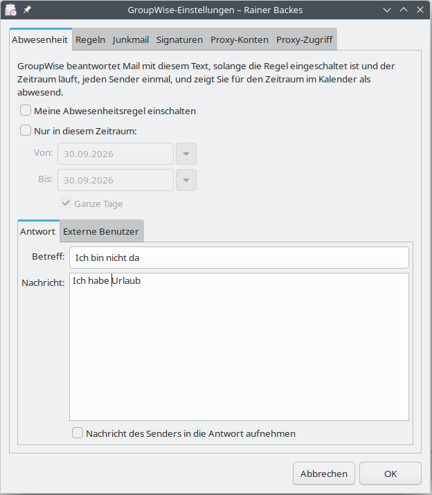
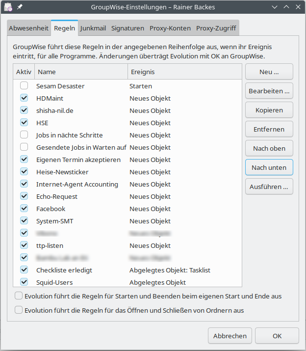
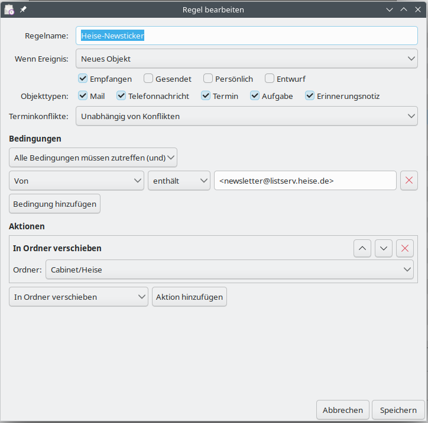
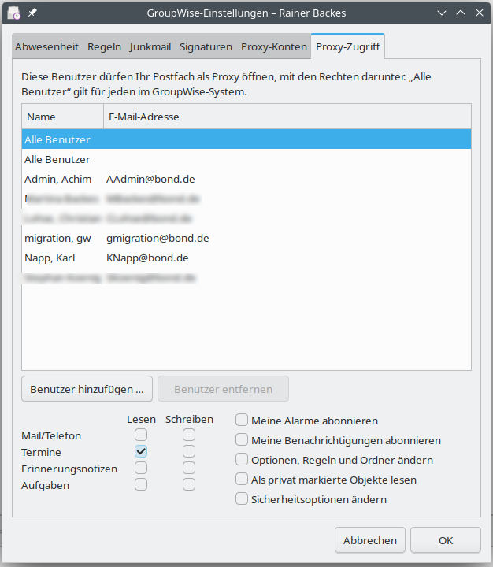
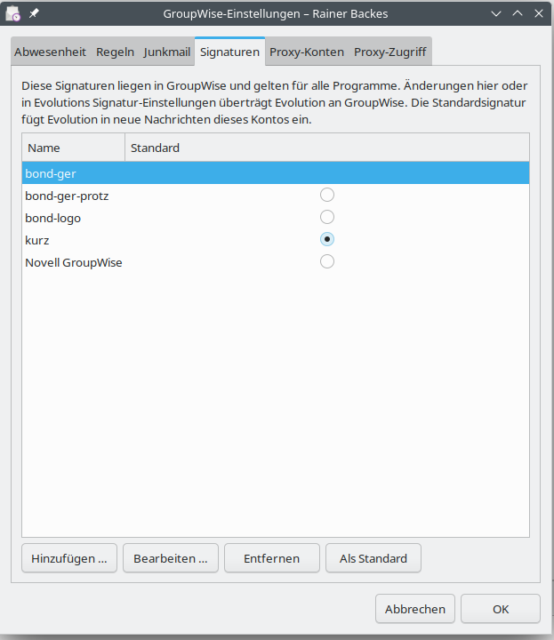
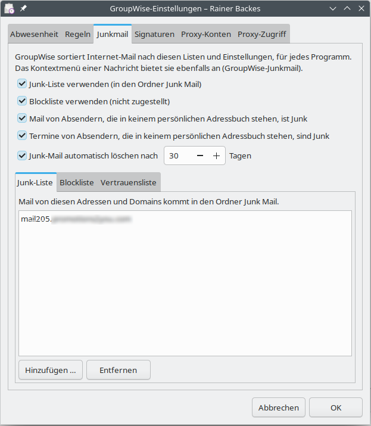
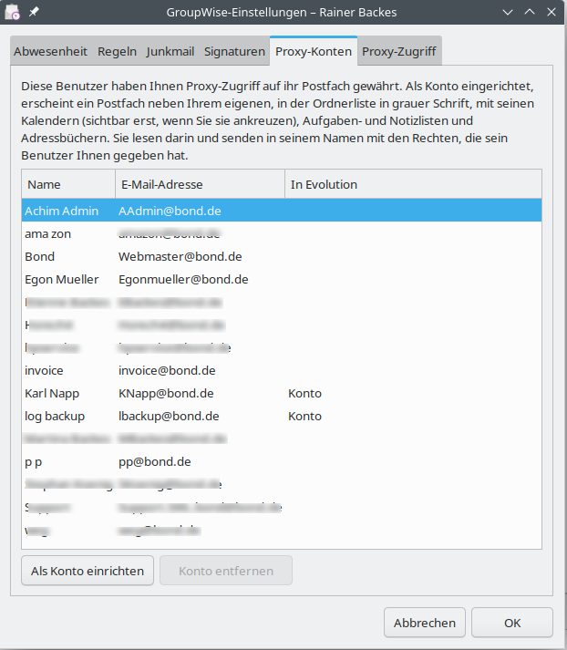

<!--
  Benutzerhandbuch von evolution-groupwise als Markdown zum Bearbeiten.
  Quelle für das PDF bleibt Benutzerhandbuch.html; Claude überträgt die
  Änderungen dorthin. Menünamen stehen in `Backticks`, **fett** und *kursiv*
  wie gewohnt, Hinweiskästen als Zitat (> ...), Bilder als 
  (die Beschreibung wird zur Bildunterschrift). Das Inhaltsverzeichnis
  entsteht automatisch aus den Überschriften.
-->

# evolution-groupwise

Benutzerhandbuch

GroupWise-Postfächer in Evolution: E-Mail, Adressbücher, Kalender, Aufgaben und Notizen über die SOAP-Schnittstelle des GroupWise Post Office Agent.

Version 0.9.1 · Oktober 2026 bond Software Entwicklung GmbH Lizenz: GNU Lesser General Public License 2.1 oder neuer

# 1 Überblick

evolution-groupwise bindet GroupWise-Postfächer direkt in das E-Mail- und Groupware-Programm **Evolution** ein. Es spricht mit dem GroupWise Post Office Agent (POA) über dessen SOAP-Schnittstelle, also auf dem gleichen Weg wie GroupWise Web. Ein zusätzlicher Dienst oder Umweg über IMAP ist nicht nötig.

Mit einer einzigen Anmeldung stehen zur Verfügung:

- **E-Mail**: alle Ordner des Postfachs, lesen und schreiben, verschieben, kopieren, löschen, Entwürfe, Senden über GroupWise – die Empfänger erhalten eine echte GroupWise-Nachricht.

- **Adressbücher**: das GroupWise-Adressbuch (nur lesen), „Häufige Kontakte“ und die persönlichen Adressbücher (lesen und schreiben), mit Autovervollständigung beim Schreiben.

- **Kalender**: Termine, ganztägige Termine, Serien, Erinnerungen, Besprechungen mit Einladungen und Antworten, Frei/Belegt-Suche; die eigenen Unterkalender, Proxy-Kalender und für Sie freigegebene Kalender als eigene Kalender.

- **Proxy-Zugriff**: Postfächer anderer Benutzer, die Ihnen Proxy-Rechte gegeben haben, als eigene Konten neben Ihrem – Mail, Kalender, Aufgaben, Notizen und Adressbücher, lesen und in deren Namen schreiben; und die Verwaltung, wer auf Ihr eigenes Postfach zugreifen darf.

- **Aufgaben und Notizen** aus dem GroupWise-Kalender.

- **Kategorien** von GroupWise als Beschriftungen (E-Mail) und Kategorien (Kalender).

## Voraussetzungen

| Komponente | Anforderung |
|---|---|
| Evolution und evolution-data-server | 3.52 oder neuer (z. B. openSUSE Leap 16, openSUSE Tumbleweed, Ubuntu 24.04, aktuelles Fedora). Die Funktion „Wiederherstellen“ im Papierkorb benötigt Evolution 3.56. |
| GroupWise | Post Office Agent mit aktiver SOAP-Schnittstelle (Standardport 7191); entwickelt und getestet mit GroupWise 26.2. |
| Zugangsdaten | GroupWise-Benutzer-ID und Passwort. |

# 2 Installation

## Installation aus einem Paket

Für openSUSE und Fedora gibt es RPM-Pakete, für Debian und Ubuntu ein .deb-Paket. Installieren Sie das Paket mit der Paketverwaltung Ihres Systems, zum Beispiel unter openSUSE:

```
sudo zypper install ./evolution-groupwise-0.9.1-0.x86_64.rpm \
                    ./evolution-groupwise-lang-0.9.1-0.noarch.rpm
```

oder unter Debian/Ubuntu:

```
sudo apt install ./evolution-groupwise_0.9.1_amd64.deb
```

Das Paket `evolution-groupwise-lang` enthält die deutsche Übersetzung (zurzeit; weitere Sprachen folgen). Starten Sie danach Evolution und die Hintergrunddienste neu, am einfachsten durch Ab- und Anmelden oder mit:

```
evolution --force-shutdown
```

## Aus den Quellen bauen

Für Entwickler und zum Testen lässt sich das Modul mit CMake bauen und ohne Administratorrechte in das Heimatverzeichnis installieren. Die Befehle dafür stehen in der Datei `README.de.md` der Quellen. Eine solche Entwicklerinstallation muss vor der Installation eines Pakets wieder entfernt werden, sonst lädt Evolution jedes Modul doppelt.

# 3 Konto einrichten

1. Wählen Sie in Evolution `Datei → Neu → E-Mail-Konto`.

2. Geben Sie Ihren Namen und Ihre E-Mail-Adresse ein.

3. Wählen Sie als Servertyp **GroupWise**. Server, Port (7191) und Benutzername werden aus der E-Mail-Adresse vorbelegt: aus *benutzer@firma.de* wird der Benutzer *benutzer* auf dem Server *mail.firma.de*. Korrigieren Sie die Werte, wenn Ihre GroupWise-Benutzer-ID oder der POA anders heißen.

4. Schließen Sie den Assistenten ab und geben Sie beim ersten Verbinden Ihr Passwort ein. Evolution kann es im Schlüsselbund speichern.

Eine Seite für den Postausgang gibt es nicht: Nachrichten werden über GroupWise selbst versendet. Das Konto erscheint anschließend in der E-Mail-Ansicht, und seine Adressbücher, Kalender, Aufgaben- und Notizlisten stehen unter der Überschrift des Kontos in den jeweiligen Ansichten.

## Zertifikat des POA

GroupWise stellt die Zertifikate seiner Agenten meist mit einer eigenen, internen Zertifizierungsstelle (CA) aus, der Linux zunächst nicht vertraut. Evolution fragt deshalb beim ersten Verbinden, wie der GroupWise-Client auch, ob es dem Zertifikat des POA vertrauen soll. Prüfen Sie die angezeigten Angaben und wählen Sie `Dauerhaft akzeptieren`; die Zustimmung gilt für das ganze Konto mit seinen Kalendern und Adressbüchern. Wird das Zertifikat des POA später erneuert, fragt Evolution einmal neu – ebenfalls wie der GroupWise-Client.

Das Zertifikat muss auf den Namen ausgestellt sein, unter dem Sie den POA ansprechen (zum Beispiel *mail.example.com*); sonst lehnt Evolution die Verbindung trotz Zustimmung als unsicher ab.

> **Für Administratoren:** Ist die CA des GroupWise-Systems bekannt, entfällt auch die Rückfrage nach einer Erneuerung. Legen Sie die CA-Datei (PEM)

- > für alle Benutzer eines Rechners nach `/etc/pki/trust/anchors/` (openSUSE) bzw. `/usr/local/share/ca-certificates/` (Debian/Ubuntu) und führen Sie `sudo update-ca-certificates` aus, oder

- > nur für einen Benutzer nach `~/.config/evolution-groupwise/ca/`.

> Der POA liefert die CA nicht mit, wohl aber der GroupWise-Administrationsdienst (Port 9710) in seiner Zertifikatskette. Vergleichen Sie vor dem Einsetzen den Fingerabdruck mit dem in der GroupWise-Administration:

```
openssl s_client -connect mail.example.com:9710 -showcerts </dev/null 2>/dev/null \
  | awk '/BEGIN CERT/{n++} n==2{print} /END CERT/ && n==2{exit}' > groupwise-ca.pem
openssl x509 -in groupwise-ca.pem -noout -subject -fingerprint -sha256
```

## Kontooptionen

Unter `Bearbeiten → Einstellungen → E-Mail-Konten → Bearbeiten` finden Sie:

| Option | Bedeutung |
|---|---|
| Den Server alle … Sekunden nach Änderungen im Postfach fragen | GroupWise notiert auf Wunsch, was im Postfach geschieht: neue, gelesene, verschobene und gelöschte Nachrichten. Mit dieser Option fragt Evolution diese Liste im eingestellten Abstand ab (Vorgabe 60 Sekunden, mindestens 15) und gleicht nur die betroffenen Ordner ab. Neue Nachrichten und alles, was Sie im GroupWise-Client oder am Mobilgerät tun, erscheinen dann innerhalb dieses Abstands statt erst beim nächsten Abruf des ganzen Kontos; die Abfrage selbst ist klein. Besonders bei Proxy-Konten spart das Zeit. Der gewohnte Abruf bleibt zusätzlich bestehen. Die Option gilt auch für **Kalender, Aufgaben und Notizen** des Kontos: Termine, die Sie im GroupWise-Client oder am Mobilgerät anlegen, ändern oder löschen, und eingehende Einladungen erscheinen ebenso schnell statt erst beim nächsten Abgleich der Kalender (alle 15 Minuten) – solange Evolution läuft. Aus, solange Sie es nicht einschalten; schalten Sie es wieder aus, entfernt Evolution die Notizen aus dem Postfach. Ihre Proxy-Konten (Abschnitt 4.8) übernehmen diese Einstellung von Ihrem eigenen Konto, auch den Abstand: Sie stellen sie nur dort ein. |
| Der Server meldet Änderungen sofort, an Port … dieses Rechners | Zusätzlich zur Abfrage oben: GroupWise meldet sich von selbst bei Evolution, sobald im Postfach etwas geschieht; neue Nachrichten erscheinen dann nach ein bis zwei Sekunden. Dazu baut der GroupWise-Server (POA) eine Verbindung *zu Ihrem Rechner* auf, an den angegebenen TCP-Port (Vorgabe 5221). Das funktioniert nur, wenn der Server Ihren Rechner erreicht – im Firmennetz, nicht hinter einem Heimrouter –, und wenn die Firewall Ihres Rechners den Port hereinlässt. Stellt Evolution fest, dass die Meldungen nicht ankommen, fragt es, ob es den Port in der Firewall öffnen soll (`Port öffnen`, `Nicht jetzt`, `Nicht mehr fragen`); das System fragt dafür nach dem Administrator-Passwort. Ohne ankommende Meldungen gilt einfach der Abstand der Abfrage oben. Nach dem Einschalten oder Ändern einer der beiden Optionen dauert es einige Minuten, bis der Server auch Nachrichten von außen und Aktionen im GroupWise-Client sofort meldet. Nur zusammen mit der Abfrage wählbar; aus, solange Sie es nicht einschalten. Auch diese Einstellung übernehmen Ihre Proxy-Konten. |
| Filter und Junk-Prüfung auf neue Nachrichten in der Mailbox anwenden | Evolutions eigene Filterregeln und die Junk-Erkennung laufen über neu eingegangene Nachrichten. Dafür lädt Evolution jede neue Nachricht vollständig; deshalb ist die Option ausgeschaltet, solange Sie sie nicht brauchen. |
| Ordnerinhalte für den Offline-Betrieb lokal kopieren | Nachrichten werden vorab heruntergeladen, damit sie auch ohne Verbindung lesbar sind. |
| Schreibgeschützt: nie etwas auf dem Server ändern | Evolution liest nur. Gelesen-Status, Verschieben, Löschen und Senden werden nicht auf den Server übertragen – nützlich zum Ausprobieren. |
| Regeln für Starten und Beenden beim Start und Ende von Evolution ausführen | Siehe Abschnitt „Regeln“: Evolution lässt GroupWise die Regeln mit dem Ereignis *Starten* bzw. *Beenden* ausführen. Aus, solange Sie es nicht einschalten. |
| Regeln für das Öffnen und Schließen von Ordnern ausführen | Ebenso für die Ereignisse *Ordner öffnen* und *Ordner schließen*. |

> **Mehrere Rechner am selben Postfach:** Für die Abfrage der Änderungen legt Evolution im Postfach einen Merkzettel an, der zu genau einem Rechner gehört; sein Name enthält eine Kennung des Rechners (aus der Maschinen-ID des Systems) und Ihren Anmeldenamen. Greifen Sie von zwei Rechnern auf dasselbe Postfach zu, hat jeder seinen eigenen – das funktioniert. Problematisch sind **geklonte Rechner** (kopierte virtuelle Maschinen, ausgerollte Images): Sie haben dieselbe Maschinen-ID und nehmen sich gegenseitig die Änderungen weg, sodass sie bei jedem nur zum Teil ankommen; auch die Sofort-Meldung geht dann nur an einen von beiden. Geben Sie einem geklonten Rechner eine neue Maschinen-ID. Schalten Sie dazu vorher die Option in Evolution aus (dann entfernt Evolution den alten Merkzettel aus dem Postfach), setzen Sie als Administrator die Maschinen-ID neu, starten Sie den Rechner neu und schalten Sie die Option wieder ein:

```
sudo rm -f /etc/machine-id /var/lib/dbus/machine-id
sudo systemd-machine-id-setup
```

> Die Maschinen-ID verwenden auch andere Teile des Systems; setzen Sie sie am besten gleich nach dem Klonen neu, noch bevor Sie Evolution einrichten.

## GroupWise-Einstellungen

Einstellungen, die der GroupWise-Server selbst für Ihr Postfach hält, bearbeiten Sie im Fenster **GroupWise-Einstellungen**: Klicken Sie in der Ordnerliste mit der rechten Maustaste auf den Namen des GroupWise-Kontos und wählen Sie `GroupWise-Einstellungen …`. Das Fenster liest die Einstellungen beim Öffnen vom Server und schreibt Ihre Änderungen mit `OK` zurück; sie gelten dann für alle Programme, auch für den GroupWise-Client und GroupWise Web. Es hat die Registerkarten **Abwesenheit**, **Regeln** (siehe unten), **Junkmail** (siehe Abschnitt 4.5), **Signaturen** (siehe Abschnitt 4.2), **Proxy-Konten** (siehe Abschnitt 4.8) und **Proxy-Zugriff** (siehe unten). Im GroupWise-Client finden Sie dieselben Einstellungen im Menü *Werkzeuge*.

Bei einem Proxy-Konto (Abschnitt 4.8) zeigt `GroupWise-Einstellungen …` die Abwesenheit und die Junk-Mail-Einstellungen des anderen Postfachs. Das setzt voraus, dass der andere Benutzer Ihnen das Proxy-Recht „Einstellungen, Regeln und Ordner ändern“ gegeben hat; sonst meldet das Fenster dies. Die Registerkarten „Proxy-Konten“ und „Proxy-Zugriff“ gibt es dort nicht.

## Abwesenheit

Die Registerkarte **Abwesenheit** entspricht der Abwesenheitsregel des GroupWise-Clients:



- **Meine Abwesenheitsregel einschalten** – solange die Regel eingeschaltet ist (und der Zeitraum läuft, falls einer gesetzt ist), beantwortet GroupWise eingehende Mail automatisch, jeden Sender nur einmal.

- **Nur in diesem Zeitraum** – von und bis zu einem Tag (**Ganze Tage**) oder zu einer Uhrzeit. GroupWise trägt für den Zeitraum einen Termin mit dem Status *Abwesend* in Ihren Kalender ein und entfernt ihn wieder, wenn Sie die Regel ausschalten. Nach dem Ende des Zeitraums antwortet GroupWise nicht mehr, auch wenn die Regel eingeschaltet bleibt.

- **Antwort** – Betreff und Text der automatischen Antwort; der Betreff erscheint in Klammern hinter dem Betreff der ursprünglichen Nachricht. Wahlweise wird die Nachricht des Senders in die Antwort aufgenommen.

- **Externe Benutzer** – ob auch Sendern außerhalb des GroupWise-Systems geantwortet wird, allen oder nur Ihren Kontakten, mit einem eigenen Betreff und Text (der Text der Registerkarte „Antwort“ gilt für sie nicht).

## Regeln

Die Registerkarte **Regeln** entspricht *Werkzeuge → Regeln* im GroupWise-Client. GroupWise führt die Regeln selbst aus, für alle Programme, in der Reihenfolge der Liste.



- **Liste**: das Häkchen *Aktiv* schaltet eine Regel ein oder aus; `Nach oben` und `Nach unten` ändern die Reihenfolge; `Neu …`, `Bearbeiten …` (oder Doppelklick), `Kopieren` und `Entfernen` wie gewohnt. Alle Änderungen überträgt Evolution mit `OK` an GroupWise.

- `Ausführen …` lässt GroupWise die gespeicherte Regel sofort auf die Objekte Ihres Postfachs anwenden (nach einer Rückfrage), zum Beispiel eine benutzeraktivierte Regel.

Der **Regel-Editor** hat nicht ganz den Umfang des GroupWise-Clients, ist dafür aber deutlich einfacher zu bedienen und sollte im Alltag ausreichen:



- **Ereignis**: *Neues Objekt* (mit den Quellen Empfangen, Gesendet, Persönlich, Entwurf), *Abgelegtes Objekt*, *Ordner öffnen*, *Ordner schließen* (jeweils für einen Ordner oder jeden), *Erledigtes Objekt*, *Starten*, *Beenden* und *Benutzeraktiviert*.

- **Objekttypen**: Mail, Telefonnachricht, Termin, Aufgabe, Erinnerungsnotiz; für Termine auch, ob die Regel nur ohne oder nur bei einem Terminkonflikt greift.

**Bedingungen**: beliebig viele, verknüpft mit „Alle Bedingungen müssen zutreffen (und)“ oder „Eine Bedingung muss zutreffen (oder)“ (eine Ebene, ohne verschachtelte Gruppen). Die Felder heißen wie im GroupWise-Client:

   - Texte (enthält, enthält nicht, beginnt mit, entspricht, ist nicht): Von, An, CC, Betreff, Mein Betreff, Nachricht, Ort, Anlagen, Anmerkung, Aufgegeben von, Konto, Name, Firma und Telefonnummer des Anrufers;

   - Datumsangaben, verglichen mit heute plus einer Anzahl Tage (z. B. „vor heute plus −3“ = älter als drei Tage): Erstellt, Zugestellt, Angefangen, Ende, Erledigen bis, In Auftrag gegeben am, Abschlussdatum;

   - Zahlen (=, ≠, >, ≥, <, ≤): Größe, % abgeschlossen, Jobpriorität; Jobkategorie (ein Buchstabe);

   - Zähler versendeter Objekte – Akzeptierte, Beantwortete, Erledigte, Gelöschte, Geöffnete Anzahl, Empfänger gesamt – mit einer Zahl oder mit einem anderen Zähler (plus einem Zuschlag), etwa „Erledigte Anzahl = Feld Empfänger gesamt“: alle Empfänger haben die Aufgabe erledigt;

   - Auswahlfelder: Priorität (Hoch, Standard, Niedrig), Kopieart (An, CC, BC), Status d. Nachricht (Akzeptiert, Erledigt, Geöffnet, Gelesen, Privat), Erweiterter Status der Nachricht (Zustände der Archivierung durch Drittanbieter), Thread-Zustand (Komprimiert, Beobachtet, Ignoriert), Anlagenliste und Persönliche Anlagen (Datei, Audio, Film, Objekt (OLE), Dokumentverweis, Mail, Termin, Job, Notiz, Tel. Nachricht), Erwähnt (ich), Sendeoptionen (Antwort erbeten).

- Felder für Dokumente und Bibliotheken sowie X-Felder von Internet-Mails bietet der Editor nicht an.

- **Aktionen**, in ihrer Reihenfolge: Mail senden, Weiterleiten, Als Anlage weiterleiten, Delegieren, Antworten, Akzeptieren, Kategorie, Löschen/Ablehnen, Nachricht tilgen, In Ordner verschieben, Mit Ordner verknüpfen, Als privat markieren, Als gelesen markieren, Als ungelesen markieren, Regelverarbeitung beenden und zuletzt **Unbedingt antworten (gefährlich)**.

> **Antworten und unbedingt antworten:** *Antworten* ist die automatische Antwort von GroupWise: sie antwortet jedem Absender höchstens einmal am Tag und vermeidet Nachrichtenschleifen. *Unbedingt antworten (gefährlich)* ist deren Vorläufer und antwortet ohne jede Einschränkung auf jede Nachricht – zwei solche Regeln, eine Mailingliste oder eine andere Abwesenheitsnotiz können sich endlos gegenseitig antworten. Verwenden Sie sie nur, wenn Sie sie wirklich brauchen.

Regeln mit Bestandteilen, die der Editor nicht darstellen kann (verschachtelte Bedingungsgruppen, Dokument- oder X-Felder, andere Aktionen wie Archivieren), zeigt er nur an; Sie können sie aber ein- und ausschalten, verschieben, ausführen und entfernen. Bearbeiten Sie sie im GroupWise-Client.

Die Ereignisse *Starten*, *Beenden*, *Ordner öffnen* und *Ordner schließen* löst in GroupWise der Client aus, nicht der Server. Mit den beiden Kontrollkästchen unter der Liste (auch in den Kontooptionen) bestimmen Sie, ob Evolution das übernimmt: beim Start und Ende von Evolution bzw. beim Öffnen und Verlassen eines Ordners. Beide sind anfangs aus – bedenken Sie, dass solche Regeln zum Beispiel Nachrichten endgültig löschen können.

## Proxy-Zugriff auf Ihr Postfach

Die Registerkarte **Proxy-Zugriff** entspricht dem Proxy-Zugriff in den Sicherheitsoptionen des GroupWise-Clients: Sie legt fest, wer Ihr Postfach als Proxy öffnen darf und mit welchen Rechten.



- Die Liste zeigt die Benutzer mit Zugriff; ganz oben steht **Alle Benutzer**, die Rechte für jeden im GroupWise-System (typisch: Termine lesen, für die Frei/Belegt-Planung).

- `Benutzer hinzufügen …` fragt nach der E-Mail-Adresse oder dem Namen eines GroupWise-Benutzers; er bekommt zunächst das Recht, Mail und Termine zu lesen. `Benutzer entfernen` nimmt ihm den Zugriff.

- Für den ausgewählten Benutzer setzen Sie darunter die Rechte: **Lesen** und **Schreiben** für Mail/Telefon, Termine, Erinnerungsnotizen und Aufgaben (Schreiben schließt Lesen ein), dazu *Meine Alarme abonnieren*, *Meine Benachrichtigungen abonnieren*, *Optionen, Regeln und Ordner ändern*, *Als privat markierte Objekte lesen* und *Sicherheitsoptionen ändern*.

Mit `OK` überträgt Evolution die Änderungen an GroupWise.

# 4 E-Mail

## 4.1 Ordner und Nachrichten

Evolution zeigt alle Ordner des GroupWise-Postfachs, wie der GroupWise-Client zuerst die Systemordner in seiner Reihenfolge – Mailbox, Ausgangsnachrichten, Jobliste, In Arbeit (Entwürfe), Junkmail, Papierkorb, Aktenschrank mit allen Unterordnern –, darunter Ihre eigenen Ordner und die Suchergebnisordner nach Namen. Die Systemordner tragen die Namen, die auch der GroupWise-Client in Ihrer Sprache zeigt. Legen Sie in Evolution selbst eine Reihenfolge fest (Kontextmenü eines Ordners, `Sortierreihenfolge bearbeiten …`), gilt diese. Freigegebene Ordner anderer Benutzer, deren übergeordneter Ordner nicht mehr existiert, blendet Evolution wie der GroupWise-Client aus. Ordner lassen sich anlegen, umbenennen, verschieben und löschen. Systemordner wie die Mailbox oder der Papierkorb bleiben, wie sie sind.

- **Nachrichtenliste**: Absender, Betreff, Datum, Größe, Anhangs-Symbol, Priorität und Gelesen-Status kommen direkt aus GroupWise. Der Inhalt einer Nachricht wird erst beim Öffnen geladen.

- **Originalnachricht**: Von außen eingegangene Nachrichten zeigt Evolution so, wie sie ankamen, mit allen Kopfzeilen.

- **Geänderter Betreff**: Haben Sie den Betreff einer Nachricht im GroupWise-Client geändert, zeigt Evolution den geänderten Betreff.

- **Gelesen/ungelesen** wird in beide Richtungen abgeglichen. Das bloße Ansehen in der Liste markiert nichts als gelesen.

- **Verschieben und Kopieren** innerhalb des Kontos geschieht auf dem Server: Eine kopierte Nachricht ist in GroupWise dieselbe Nachricht in einem weiteren Ordner.

- **Einladungen** in der Mailbox erscheinen als Nachrichten; beantworten Sie sie in der Nachrichtenansicht oder im Kalender. Beantwortete Einladungen verschwinden wie im GroupWise-Client aus der Mailbox.

Evolution prüft regelmäßig auf neue Nachrichten. Zwischen zwei vollständigen Abgleichen (höchstens alle 15 Minuten) fragt es nur die Änderungen seit dem letzten Mal ab.

## 4.2 Schreiben und Senden

Nachrichten werden über GroupWise versendet: Interne Empfänger erhalten eine native GroupWise-Nachricht, externe eine normale E-Mail. Die gesendete Nachricht liegt danach in den Ausgangsnachrichten.

- **HTML und Text**, eingebettete Bilder, Anhänge und die Priorität werden übernommen.

- **Entwürfe** werden im Ordner *In Arbeit* gespeichert und sind so auch im GroupWise-Client zu sehen.

- **Weiterleiten als Anhang**: Leiten Sie eine GroupWise-Nachricht als Anhang weiter, hängt GroupWise die Nachricht selbst an, wie der GroupWise-Client. Interne Empfänger sehen sie als GroupWise-Nachricht und nicht als MIME-Datei.

- **Absender**: Gesendet wird immer über das Konto, zu dem die gewählte Absenderidentität gehört. Mehrere GroupWise-Konten nebeneinander sind möglich.

### Zustellstatus und Zurückziehen

Wie im GroupWise-Client sehen Sie bei gesendeten Nachrichten, was bei den Empfängern damit geschah, und können sie zurückziehen. Beides steht im Ordner *Ausgangsnachrichten* eines GroupWise-Kontos im Kontextmenü einer Nachricht und im Menü `Nachricht`:

- `Zustellstatus …` öffnet für die ausgewählte Nachricht ein Fenster mit allen Empfängern (An, CC, BC) und darunter jedem Ereignis mit Zeitpunkt: zugestellt, geöffnet, gelöscht, beantwortet, weitergeleitet, zurückgezogen, bei Terminen angenommen oder abgelehnt (mit Kommentar) und weitere. Bei Empfängern außerhalb von GroupWise steht meist nur „Übertragen“.

- `Neu senden …` öffnet die Nachricht wie im GroupWise-Client in einem neuen Nachrichtenfenster, in dem Sie sie ändern können. Die Signatur steht auf „Keine“, weil die Nachricht ihre Signatur schon enthält. Beim `Senden` fragt Evolution, ob die ursprüngliche Nachricht bei den Empfängern zurückgezogen werden soll: `Zurückziehen`, `Nicht zurückziehen` oder `Abbrechen` (zurück ins Nachrichtenfenster).

- `Zurückziehen …` holt die ausgewählten Nachrichten nach einer Rückfrage aus den Postfächern der Empfänger in GroupWise zurück. Die gesendete Nachricht bleibt in den Ausgangsnachrichten; ihr Zustellstatus zeigt die Empfänger dann als „Zurückgezogen“. Empfänger außerhalb von GroupWise haben die Nachricht bereits erhalten. Bei einem nur lesbaren Konto fehlt der Eintrag.

### Signaturen

Ihre Signaturen aus GroupWise stehen in Evolution zur Verfügung: im Feld `Signatur:` des Nachrichten-Editors und unter `Bearbeiten → Einstellungen → Editoreinstellungen → Signaturen`, mit Bildern. Die Standardsignatur von GroupWise fügt Evolution in neue Nachrichten des Kontos ein, auch wenn GroupWise vor dem Senden fragen soll; im Editor wählen Sie eine andere oder „Keine“. Die Signaturen eines Proxy-Kontos tragen den Namen des Kontos, etwa „Karl – Karl Napp (Proxy)“.

Signaturen bearbeiten Sie im Fenster **GroupWise-Einstellungen**, Registerkarte **Signaturen**:



- `Hinzufügen …` und `Bearbeiten …` öffnen Evolutions Signatur-Editor; beim Speichern überträgt Evolution die Signatur an GroupWise.

- `Entfernen` löscht die Signatur, auch in GroupWise.

- `Als Standard` macht die ausgewählte Signatur mit `OK` zur Standardsignatur in GroupWise und zur Signatur des Kontos in Evolution.

Auch Änderungen und Löschungen unter `Editoreinstellungen → Signaturen` überträgt Evolution an GroupWise. Neue Signaturen, die Sie dort mit `Hinzufügen` anlegen, bleiben dagegen nur in Evolution, weil sie keinem Konto zugeordnet sind. Änderungen im GroupWise-Client übernimmt Evolution beim nächsten Verbinden des Kontos. Entfernen Sie ein ganzes Konto, bleiben seine Signaturen in GroupWise erhalten.

> **Empfehlung: Nachrichten in HTML schreiben.** Schreiben Sie im GroupWise-Client eine einfache Nachricht, verwendet er ein eigenes, erweitertes Textformat, das noch aus den Anfängen von GroupWise stammt. Dieses Format kann Evolution nicht verarbeiten; eine Nur-Text-Nachricht ist bei Evolution daher wirklich nur Text. Sinnvoller ist das HTML-Format, der heutige Standard für E-Mail. Stellen Sie unter `Bearbeiten → Einstellungen → Editoreinstellungen` die Auswahl `Nachrichten formatieren als` auf **HTML**. Dann fügt Evolution die Signatur mit Formatierung und Bildern ein, so wie GroupWise sie speichert. Schreiben Sie dagegen im Format „Einfacher Text“, fügt Evolution die Textfassung der Signatur ein, und die bleibt auch dann reiner Text, wenn Sie das Format in der Auswahl über dem Nachrichtentext nachträglich auf HTML umschalten; erst eine erneute Auswahl der Signatur (zum Beispiel „Keine“ und dann wieder die Signatur) holt die HTML-Fassung.

> **Hinweis:** Signierte oder verschlüsselte Nachrichten (S/MIME, PGP) können nicht über GroupWise versendet werden, weil der POA die Nachricht für die Empfänger selbst zusammenbaut. Evolution meldet das beim Senden.

## 4.3 Löschen und Papierkorb

Gelöschte Nachrichten wandern in den GroupWise-Papierkorb, wie im GroupWise-Client.

- **Wiederherstellen**: Markieren Sie Nachrichten im Papierkorb und wählen Sie `Wiederherstellen` ganz oben im Kontextmenü oder unter `Bearbeiten → Wiederherstellen`. Die Nachrichten kehren in die Ordner zurück, aus denen sie gelöscht wurden. Existiert ein Ordner nicht mehr, kommen sie in die Mailbox. (Benötigt Evolution 3.56.)

- **Papierkorb leeren** (Kontextmenü des Papierkorbs bzw. des Kontos, `Papierkorb leeren`) löscht endgültig, was in keinem anderen Ordner mehr liegt. Nachrichten, die noch in einem anderen Ordner liegen (weil nur eine Kopie gelöscht wurde), verlassen lediglich den Papierkorb und bleiben in ihren Ordnern erhalten.

- **Endgültig löschen** (`Umschalt+Entf` bzw. Löschen und Bereinigen) entfernt eine Nachricht ohne Umweg über den Papierkorb aus allen Ordnern.

## 4.4 Beschriftungen und Kategorien

GroupWise-Kategorien erscheinen in Evolution als **Beschriftungen**. Die vier vordefinierten Kategorien von GroupWise entsprechen Evolutions Standard-Beschriftungen:

| GroupWise | Evolution |
|---|---|
| Urgent (Dringend) | Wichtig |
| Personal (Persönlich) | Persönlich |
| Follow-up (Nachverfolgung) | Zu erledigen |
| Low priority (Niedrige Priorität) | Später |

- Ihre **eigenen Kategorien** werden beim Verbinden mit ihrer GroupWise-Farbe in Evolutions Beschriftungsliste aufgenommen (`Bearbeiten → Einstellungen → E-Mail-Einstellungen → Beschriftungen`). Kategorien, die in GroupWise ausgeblendet sind, bleiben draußen.

- Setzen oder entfernen Sie eine Beschriftung (Kontextmenü `Beschriftung`), wird die Kategorie in GroupWise gesetzt bzw. entfernt. Eine Beschriftung, die GroupWise noch nicht als Kategorie kennt – etwa „Arbeit“ –, wird dort als neue Kategorie angelegt.

- Im GroupWise-Client gesetzte Kategorien erscheinen beim nächsten Abgleich in Evolution.

### Folgenachricht und Jobliste

Was Evolution „Folgenachricht“ nennt, ist keine eigene Nachricht, sondern eine **Markierung zur Nachverfolgung** an einer vorhandenen Nachricht (englisch „Follow-Up“: nachfassen, sich noch darum kümmern), wahlweise mit Fälligkeitsdatum. Die Nachrichtenliste zeigt sie mit einer Fahne, erledigte mit einem Haken. Genau das ist in GroupWise die **Jobliste**, und Evolution gleicht beides in beide Richtungen ab:

- `Als Folgenachricht markieren …` setzt die Nachricht auf die Jobliste, mit dem dort gewählten Fälligkeitsdatum (`Fällig am`). Die Nachricht bleibt in ihrem Ordner; im GroupWise-Client erscheint sie zusätzlich in der Jobliste.

- `Als abgeschlossen markieren` hakt sie in der Jobliste als erledigt ab; wird der Haken im GroupWise-Client wieder entfernt, ist sie in Evolution wieder offen.

- `Markierung löschen` nimmt sie von der Jobliste; die Nachricht selbst bleibt erhalten.

- Umgekehrt zeigt Evolution Nachrichten, die im GroupWise-Client auf die Jobliste gesetzt wurden, als markiert, mit Fälligkeit und Erledigt-Zustand. Den Text der Markierung („Folgenachricht“, „Antworten“ …) kennt GroupWise nicht; er bleibt nur in Evolution.

Markierungen, die Sie schon vor Version 0.8.0 in Evolution gesetzt hatten, überträgt Evolution beim ersten Abgleich auf die Jobliste.

## 4.5 Junk-Mail

GroupWise sortiert unerwünschte Internet-Mail selbst: nach einer **Junk-Liste** (Mails kommen in den Ordner „Junkmail“), einer **Blockliste** (Mails werden gar nicht zugestellt) und einer **Vertrauensliste** (Mails sind nie Junk, sie hat Vorrang). Einträge sind E-Mail-Adressen oder Internet-Domains. Für interne Mail aus dem GroupWise-System gelten die Listen nicht.

- **Als unerwünscht markieren** (Kontextmenü `Als unerwünscht markieren` oder `Strg+J`): Die Nachricht wandert in den Ordner „Junkmail“, und ihr Absender kommt auf die Junk-Liste von GroupWise (und von der Vertrauensliste).

- **Als erwünscht markieren** (Kontextmenü `Als erwünscht markieren` oder `Umschalt+Strg+J`) im Ordner „Junkmail“: Die Nachricht kehrt in die Mailbox zurück, und ihr Absender kommt auf die Vertrauensliste (und von Junk- und Blockliste).

- Evolution zeigt keinen zusätzlichen, eigenen Junk-Ordner mehr; Nachrichten, die Evolutions eigene Junk-Prüfung erkennt, werden nur verschoben, die Listen bleiben unverändert.

Wie im GroupWise-Client können Sie auch gezielt eine Adresse oder eine ganze Domain einordnen: Das Kontextmenü einer Nachricht hat, direkt unter Evolutions eigenen Einträgen, das Untermenü `GroupWise-Junkmail` mit

- `Sender als verbürgt einstufen …` – auf die Vertrauensliste; die Nachricht kommt aus „Junkmail“ zurück in die Mailbox,

- `Sender als Junk einstufen …` – auf die Junk-Liste; die Nachricht kommt in den Ordner „Junkmail“,

- `Sender blockieren …` – auf die Blockliste; künftige Mail wird nicht mehr zugestellt, die Nachricht kommt in den Ordner „Junkmail“,

- `Junkmail-Einstellungen …` – öffnet die GroupWise-Einstellungen des Kontos auf der Registerkarte „Junkmail“.

Ein Dialog fragt jeweils, ob nur die Adresse oder die ganze Domain (mit ihren Subdomains) eingetragen wird. In den Ordnern eines Proxy-Kontos (Abschnitt 4.8) wirkt das Untermenü auf die Listen des anderen Postfachs; dafür braucht es das Proxy-Recht „Einstellungen, Regeln und Ordner ändern“.

Darunter steht `Absender zum Adressbuch hinzufügen` (in Evolution sonst nur im Menü `Nachricht`): Ein Dialog lässt das Zieladressbuch wählen, über `Vollständig bearbeiten` ergänzen Sie weitere Angaben. Steht die Einstellung „Mail von Absendern, die in keinem persönlichen Adressbuch stehen, ist Junk“, gilt ein Absender in einem Ihrer persönlichen GroupWise-Adressbücher damit als erwünscht.

Die Einstellungen und Listen selbst bearbeiten Sie im Fenster **GroupWise-Einstellungen**, das Sie über das Kontextmenü des GroupWise-Kontos in der Ordnerliste öffnen (`GroupWise-Einstellungen …`). Auf der Registerkarte **Junkmail** können Sie



- Junk-Liste und Blockliste ein- oder ausschalten,

- Mails und Termine von Absendern, die in keinem persönlichen Adressbuch stehen, als Junk einstufen,

- Junk-Mail nach einer Anzahl Tage automatisch löschen,

- die drei Listen ansehen und Einträge hinzufügen oder entfernen,

- Einträge über das Kontextmenü einer Liste in eine der anderen verschieben (`Auf die Junk-Liste verschieben`, `Auf die Blockliste verschieben`, `Auf die Vertrauensliste verschieben`).

Mit `OK` werden die Änderungen an GroupWise übertragen und gelten dann für alle Programme, auch den GroupWise-Client. Den Ordner „Junkmail“ legt GroupWise an, sobald die Junk-Mail-Verwaltung eingeschaltet ist.

## 4.6 Suchergebnisordner

Suchergebnisordner von GroupWise (zum Beispiel „Alle Mails“) zeigt Evolution als Ordner an. Löschen und Verschieben wirken in dem Ordner, in dem die Nachricht wirklich liegt; in einen Suchergebnisordner selbst kann nichts verschoben werden. Diese Ordner werden höchstens alle 15 Minuten abgeglichen und nicht für den Offline-Betrieb kopiert.

> **Grenze:** Über SOAP liefert der POA nur einen Teil der Treffer eines Suchergebnisordners (im Test gut 4000 von über 60 000). Für vollständige Suchen verwenden Sie die Suche von Evolution oder Evolutions eigene Suchordner (`Bearbeiten → Suchordner`).

## 4.7 Offline arbeiten

Ordnerstruktur und Nachrichtenliste bleiben auch ohne Verbindung sichtbar, ebenso bereits geöffnete Nachrichten. Mit der Kontooption „Ordnerinhalte für den Offline-Betrieb lokal kopieren“ oder der gleichnamigen Ordnereigenschaft lädt Evolution die Nachrichten vorab. Änderungen, die offline entstehen (gelesen, Beschriftungen), werden beim nächsten Verbinden übertragen.

## 4.8 Proxy-Zugriff auf andere Postfächer

Hat Ihnen ein anderer Benutzer im GroupWise-Client Proxy-Rechte auf sein Postfach gegeben, können Sie es in Evolution als **Proxy-Konto** neben Ihrem eigenen Konto öffnen. Der GroupWise-Client schaltet dafür das ganze Fenster auf das andere Postfach um; in Evolution stehen beide Postfächer gleichzeitig in der Ordnerliste. Name und Ordner eines Proxy-Kontos erscheinen in **grauer Schrift**. Zum Proxy-Konto gehören auch die Kalender (mit Unterkalendern), Aufgaben- und Notizlisten und die persönlichen Adressbücher des anderen Benutzers; sie stehen in den jeweiligen Ansichten unter der Überschrift des Proxy-Kontos.

So richten Sie ein Proxy-Konto ein:

1. Klicken Sie in der Ordnerliste mit der rechten Maustaste auf Ihr GroupWise-Konto und wählen Sie `GroupWise-Einstellungen …`.

2. Die Registerkarte **Proxy-Konten** listet alle Benutzer, die Ihnen Proxy-Rechte gegeben haben. Die Spalte „In Evolution“ zeigt, für wen es schon ein Konto gibt.

3. Wählen Sie den Benutzer aus und klicken Sie auf `Als Konto einrichten` (bzw. `Konto entfernen`). Mit `OK` legt Evolution das Konto an oder entfernt es.



Ein Proxy-Konto heißt „*Name* (Proxy)“ und ist ein eigenständiges Konto: Sie können es unter `Bearbeiten → Einstellungen → E-Mail-Konten` umbenennen, deaktivieren oder entfernen – mit seinen Kalendern und Adressbüchern –, ohne Ihr eigenes Konto zu berühren. Es meldet sich mit Ihrem eigenen Passwort als Proxy am anderen Postfach an; beim Einrichten legt Evolution Ihr Passwort dafür auch für das Proxy-Konto im Schlüsselbund ab. Ändern Sie Ihr GroupWise-Passwort, fragt Evolution beim Proxy-Konto einmal danach. Zum Konto gehört eine Absenderidentität mit Namen und Adresse des anderen Benutzers:

- **Lesen**: alle Ordner des anderen Postfachs, wie beim eigenen Konto.

- **Kalender**: Die Kalender, Aufgaben- und Notizlisten des Proxy-Kontos sind anfangs **nicht angekreuzt**, also nicht sichtbar; kreuzen Sie in der Kalenderliste an, was Sie sehen möchten – zum Beispiel die Ressource eines Besprechungsraums. Hat der andere Benutzer Ihnen das Schreibrecht für Termine (bzw. Aufgaben, Erinnerungsnotizen) gegeben, können Sie darin Einträge anlegen, ändern und löschen; sonst nur lesen. Erinnerungen für seine Termine erhalten Sie nicht.

- **Adressbücher**: seine persönlichen Adressbücher (lesen und schreiben), ohne Autovervollständigung beim Schreiben; das GroupWise-Adressbuch haben Sie ja schon im eigenen Konto.

- **Senden**: Wählen Sie beim Schreiben die Identität des Proxy-Kontos als Absender. Die Nachricht geht über die Proxy-Anmeldung im Namen des anderen Benutzers hinaus, wie im GroupWise-Client, und liegt danach in dessen Ausgangsnachrichten.

- **Rechte**: Es gelten die Rechte, die der andere Benutzer Ihnen gegeben hat. Ohne Schreibrecht für Mail ist das Konto schreibgeschützt (kein Verschieben, Löschen, Senden, Gelesen-Status). Ohne Leserecht für Mail verbindet es sich nicht und meldet das.

- **Einstellungen**: Mit dem Proxy-Recht „Einstellungen, Regeln und Ordner ändern“ bearbeiten Sie über das Kontextmenü des Proxy-Kontos (`GroupWise-Einstellungen …`) die Abwesenheit und die Junk-Mail-Einstellungen des anderen Postfachs, und das Untermenü `GroupWise-Junkmail` wirkt auf dessen Listen.

- Nimmt der andere Benutzer die Proxy-Rechte zurück, steht das Konto auf der Registerkarte mit dem Vermerk „Zugriff nicht mehr gewährt“; entfernen Sie es dort.

- Proxy-Konten aus älteren Versionen (0.3, 0.4) führt die Registerkarte mit dem Vermerk „Konto wird mit OK neu eingerichtet“; mit `OK` werden sie in der neuen Form angelegt.

Die Kalender anderer Benutzer, die Sie im GroupWise-Client als Proxy-Kalender hinzugefügt haben, erscheinen unter Ihrem eigenen Konto (siehe Abschnitt 5.1) – außer für Benutzer, für die Sie ein Proxy-Konto eingerichtet haben: deren Kalender stehen dann nur beim Proxy-Konto.

# 5 Kalender

## 5.1 Die Kalender eines Kontos

In der Kalenderansicht stehen unter dem Namen des Kontos, in dieser Reihenfolge:

1. **Kalender** – der GroupWise-Hauptkalender. Er zeigt die Termine, die in keinem Unterkalender liegen.

2. **Ihre Unterkalender** (zum Beispiel „Privat“ oder „Schulungen“) – jeweils als eigener Kalender, in der Farbe, die er in GroupWise hat. Ein Termin aus „Privat“ steht in Evolution nur in „Privat“, auch wenn der GroupWise-Client ihn zusätzlich im Hauptkalender anzeigt.

3. **Proxy-Kalender** – die Kalender anderer Benutzer, die Ihnen Proxy-Rechte eingeräumt haben und die Sie im GroupWise-Client als Proxy-Kalender hinzugefügt haben. Evolution meldet sich dafür mit Ihrem Passwort als Proxy am anderen Postfach an. Den Besitzer erkennt es an seiner eindeutigen Kennung, auch wenn der Kalender oder der Benutzer umbenannt wurde. Eine Besprechung, an der Sie selbst ebenfalls teilnehmen, zeigt Evolution wie der GroupWise-Client nur einmal: in Ihrem eigenen Kalender bzw. Unterkalender und in dessen Farbe, nicht noch einmal im Proxy-Kalender. Fahren Sie mit der Maus über einen Termin eines Proxy-Kalenders, nennt die Kurzinfo den Eigentümer als „Organisator“. Im Termin-Editor erscheint dieser Eintrag nicht; der Termin bleibt ein normaler Termin.

4. **Freigegebene Kalender** – Kalender, die andere Benutzer für Sie freigegeben haben, mit dem Namen des Besitzers in Klammern.

Proxy-Kalender und freigegebene Kalender sind derzeit **nur lesbar**; für sie gibt es auch keine Erinnerungen. Abonnierte Internet-Kalender, die GroupWise selbst abruft, werden nicht angezeigt – solche Kalender kann Evolution bei Bedarf direkt abonnieren.

Evolution gleicht die Kalender alle 15 Minuten mit dem Server ab, sodass Änderungen aus dem GroupWise-Client von selbst erscheinen. Schneller geht es mit der Kontooption „Den Server alle … Sekunden nach Änderungen im Postfach fragen“ (Kapitel 3, Kontooptionen): Dann erscheinen sie innerhalb des dort eingestellten Abstands, mit der Sofort-Meldung des Servers nach wenigen Sekunden. Das Intervall können Sie in den Eigenschaften eines Kalenders ändern.

## 5.2 Termine und Serien

- Termine mit Ort, Beschreibung, Status (belegt, vorläufig, frei, abwesend) und Erinnerung werden in beide Richtungen übertragen. Zeiten stehen in Ihrer Zeitzone.

- **Ganztägige Termine** reichen wie in GroupWise über ganze Tage.

- **Erinnerungen**: GroupWise kennt eine Erinnerung je Termin, vor Beginn. Evolution zeigt sie für den Hauptkalender und Ihre Unterkalender an.

- **Serien**: GroupWise speichert keine Wiederholungsregel, sondern legt jeden Termin einer Serie einzeln an. Evolution zeigt sie daher als einzelne Termine; Änderungen und Löschen betreffen den jeweiligen Termin. Eine neue Serie (täglich, wöchentlich, monatlich, jährlich) legen Sie in Evolution wie gewohnt mit einer Wiederholung an.

- Ein neuer Termin in einem Unterkalender wird direkt in diesem Unterkalender angelegt, bei Serien jeder einzelne Termin.

## 5.3 Besprechungen und Einladungen

Besprechungen verschickt und beantwortet GroupWise selbst. Evolution sendet für diese Kalender keine eigenen Einladungs-E-Mails.

- **Einladen**: Legen Sie einen Termin mit Teilnehmern an und senden Sie ihn. Die Teilnehmer erhalten eine GroupWise-Einladung; ihre Antworten erscheinen am Termin. Wie im GroupWise-Client stehen Sie selbst – genauer: der Inhaber des gewählten Kalenders – bei einer neuen Besprechung bereits als Teilnehmer in der Liste, mit dem Status „Angenommen“. Wählen Sie oben einen anderen GroupWise-Kalender, tauscht Evolution den Eintrag aus. Lassen Sie den Eintrag stehen: An Ihrer eigenen Kopie der Besprechung hängen Ihre Erinnerung, Ihre Kategorien und Ihre Reisezeit ([5.7](#kal-reisezeit)). Ohne ihn hat die Besprechung keine Reisezeit – und wie im GroupWise-Client erscheint sie dann auch nicht in Ihrem Kalender, sondern nur in den Ausgangsnachrichten. Eine Annahmeregel für eigene Termine (z. B. „eigenen Termin akzeptieren“) greift wie beim GroupWise-Client.

- **Ändern**: Eine geänderte Besprechung wird erneut an die Teilnehmer gesendet. Ihre persönlichen Angaben – Erinnerung und ein für sich selbst geänderter Betreff – betreffen nur Ihre eigene Kopie und lösen keinen neuen Versand aus.

- **Neu von überall**: `Neu → Besprechung` (ebenso Termin, Aufgabe, Notiz) legt den Eintrag in dem Kalender oder der Liste an, die in der Kalender-, Aufgaben- oder Notizansicht ausgewählt ist – auch wenn Sie gerade eine andere Ansicht (etwa die Nachrichten) vor sich haben und diese Auswahl nicht sehen. Wäre das dann das Postfach eines anderen Benutzers (ein Proxy-Konto, ein Proxy- oder freigegebener Kalender), nimmt Evolution mit GroupWise stattdessen den Kalender bzw. die Liste Ihres Hauptkontos: Organisator einer neuen Besprechung sind dann Sie und nicht zufällig der Benutzer, dessen Kalender zuletzt ausgewählt war. Im Editor können Sie Kalender und Organisator wie gewohnt ändern. Legen Sie den Eintrag in seiner eigenen Ansicht an (eine Besprechung in der Kalenderansicht), gilt wie bisher der dort ausgewählte Kalender – so setzen Sie eine Besprechung für einen anderen Benutzer an. Ist noch nie ein Kalender ausgewählt worden, verwendet Evolution seinen Standardkalender. Beim ersten Start mit einem GroupWise-Konto wird das der Kalender Ihres Hauptkontos (entsprechend die Aufgaben- und die Notizliste), solange noch „Auf diesem Rechner“ voreingestellt ist; einen anderen Standard legen Sie in den Eigenschaften eines Kalenders mit `Als Vorgabekalender markieren` fest.

- **Teilnehmer und Empfänger auswählen**: Beim Tippen eines Namens durchsucht Evolution die Adressbücher, die Sie unter `Bearbeiten → Einstellungen → Kontakte → Automatische Vervollständigung` angekreuzt haben. Dieselbe Auswahl gilt mit GroupWise auch im Dialog `Kontakte aus dem Adressbuch wählen`, den der Knopf `Teilnehmer …` einer Besprechung, zugewiesenen Aufgabe oder Notiz und die Knöpfe `An:`, `Kopie an:` und `Blindkopie an:` einer Nachricht öffnen: Im Feld `Adressbuch` steht beim Öffnen `Automatisch`, und Liste und Suche gehen über alle angekreuzten Adressbücher zugleich. Wählen Sie dort ein einzelnes Adressbuch, wenn Sie nur darin suchen möchten. (Das Feld für Blindkopien blenden Sie im Nachrichtenfenster mit `Ansicht → Blindkopie-Feld` ein.)

- **Löschen und Zurückziehen**: Löschen Sie eine Besprechung, die Sie selbst angesetzt haben, fragt Evolution wie der GroupWise-Client nach. Im Feld `Löschungsgrund` können Sie einen Kommentar zum Zurückziehen eingeben. `Löschen und benachrichtigen` zieht die Besprechung auch aus den Postfächern der Teilnehmer im GroupWise-System zurück; wer sie schon geöffnet oder angenommen hatte, erhält von GroupWise eine Mitteilung mit Ihrem Kommentar. `Nur für mich löschen` (bei anderen Konten heißt der Knopf „Ohne Benachrichtigung löschen“) entfernt sie nur aus Ihrem Kalender, wie „nur eigene Mailbox“ im GroupWise-Client: Sie nehmen nicht mehr teil, bei den Teilnehmern bleibt die Besprechung stehen. Sie liegt weiter im Ordner `Gesendete Objekte`; dort sehen Sie den Zustellstatus mit den Antworten und können sie später noch zurückziehen. Bei Besprechungen, die schon vorbei sind, bietet Evolution die Benachrichtigung nicht an.

- **Antworten**: Einladungen beantworten Sie in der Nachrichtenansicht (Annehmen, Vorläufig, Ablehnen) oder im Kalender über das Kontextmenü des Termins (`UAwg senden`). Die Antwort geht über GroupWise an den Organisator. Unbeantwortete Einladungen erscheinen im Kalender fett, vorläufig angenommene kursiv, abgelehnte durchgestrichen.

- **Teilnehmer in der Kurzinfo**: Fahren Sie mit der Maus über eine Besprechung, listet die Kurzinfo unter „Kommentare“ die Teilnehmer mit ihrer Antwort (angenommen, abgelehnt, vorläufig, noch keine Antwort). Bei mehr als acht Teilnehmern stehen dort nur die Benutzer, für die Sie als Proxy arbeiten; „… (+5)“ am Ende sagt, wie viele weitere Teilnehmer es gibt.

- **Ressourcen**: Räume und andere GroupWise-Ressourcen laden Sie wie Teilnehmer ein, auch über den Abschnitt „Ressourcen“ im Dialog hinter der Schaltfläche `Teilnehmer …`; GroupWise erhält sie wie vom GroupWise-Client als Teilnehmer (nicht als Blindkopie), mit ihrem Namen. Laden Sie eine Ressource vom Typ Ort ein (einen Raum) und hat die Besprechung noch keinen Ort, trägt Evolution wie der GroupWise-Client den Namen der Ressource als Ort ein – schon beim Schließen des Teilnehmer-Dialogs. Andere Ressourcen (z. B. ein Beamer) ändern den Ort nicht.

- **Frei/Belegt**: Die Verfügbarkeit interner Teilnehmer fragt Evolution bei GroupWise ab (Registerkarte „Planung“ im Termin-Editor).

- **Überschneidungen**: Speichern Sie einen neuen Termin oder einen mit geänderter Zeit, prüft Evolution wie der GroupWise-Client, ob er – samt seiner Vorbereitungs- und Reisezeit – belegte Zeit in Ihren Kalendern (Hauptkalender und Unterkalender) überschneidet, auch die Reisezeit anderer Termine. Dann fragt es mit einer Liste der betroffenen Termine nach; mit `Trotzdem speichern` speichern Sie, mit `Abbrechen` kehren Sie in den Editor zurück. Termine mit „Frei“, abgelehnte und ganztägige Termine zählen nicht.

## 5.4 Termine zwischen Kalendern verschieben

Einen Termin verschieben Sie zwischen dem Hauptkalender und Ihren Unterkalendern auf zwei Wegen:

- im Kontextmenü des Termins mit `In Kalender verschieben …`, oder

- im Termin-Editor durch Auswahl eines anderen Kalenders oben und Speichern.

Der Termin bleibt dabei derselbe GroupWise-Termin; er wird auf dem Server verschoben, nicht neu angelegt. Eine Besprechung wird dabei weder zurückgezogen noch erneut versendet. Kopieren (`In Kalender kopieren …`) legt dagegen einen neuen, unabhängigen Termin an.

> **Hinweis:** Das Ziehen eines Termins auf einen Kalender in der Seitenleiste funktioniert in Evolution nicht zuverlässig – unabhängig von GroupWise, auch bei lokalen Kalendern. Verwenden Sie das Kontextmenü oder den Editor.

## 5.5 Kategorien

Die GroupWise-Kategorien eines Termins erscheinen in Evolution als Kategorien des Termins, mit den gleichen Namen wie die Beschriftungen bei E-Mail (die vordefinierten also als Wichtig, Persönlich, Zu erledigen, Später). Im Termin-Editor blenden Sie das Kategorienfeld mit `Ansicht → Kategorien` ein. Eine Kategorie, die GroupWise noch nicht kennt, wird dort angelegt. Bei Besprechungen gehören Kategorien zu Ihrer eigenen Kopie; sie lösen keinen neuen Versand aus.

Anders als im GroupWise-Client färben Kategorien Termine in Evolution nicht ein – die Farbe kommt immer vom Kalender.

## 5.6 Farbe und Eigenschaften

Über `Eigenschaften` im Kontextmenü eines Kalenders ändern Sie Farbe und angezeigten Namen sowie das Abgleichintervall. Die Farbe aus GroupWise wird nur beim ersten Anlegen übernommen; Ihre Änderungen in Evolution bleiben erhalten. Die Reihenfolge der Kalender (Hauptkalender, Unterkalender, Proxy-Kalender, freigegebene Kalender) legt das Modul beim ersten Anlegen fest. Neue GroupWise-Kalender können hier nicht angelegt werden – sie erscheinen automatisch, sobald sie in GroupWise existieren.

## 5.7 Vorbereitungs- und Reisezeit

Wie im GroupWise-Client kann ein Termin eine Vorbereitungs- bzw. Reisezeit davor und danach haben. GroupWise belegt diese Zeiten mit eigenen Terminen „Before: *Betreff*“ und „After: *Betreff*“, und so zeigt sie auch Evolution – als belegte Zeit direkt vor und nach dem Termin.

**Festlegen:** Im Termin-Editor eines GroupWise-Kalenders gibt es die Registerkarte `Reisezeit` mit dem roten Auto – dem Symbol, mit dem der GroupWise-Client die Reisezeit aufruft. Dort geben Sie Stunden und Minuten ein, getrennt für `Vor dem Termin` und `Nach dem Termin`; die Minuten springen mit den Pfeilen in Schritten von 5. Ist `Reisezeiten vor/nach Termin sind gleich` angekreuzt, übernimmt die Zeit danach die Zeit davor. Beim Speichern legt GroupWise die Termine „Before:“ und „After:“ an oder passt sie an. Setzen Sie eine Zeit auf 0, verschwindet der zugehörige Termin wieder – wie im GroupWise-Client. Bei einer neuen Besprechung setzt Evolution die Reisezeit an Ihrer eigenen Kopie, sobald diese beim nächsten Abgleich – gleich nach dem Senden – vorliegt; die Termine „Before:“ und „After:“ erscheinen daher einen Moment später.

- Die Reisezeit gehört **nur Ihnen**: Laden Sie zu einer Besprechung ein, erhalten die Teilnehmer sie nicht. Umgekehrt können Sie auch bei einer erhaltenen Einladung Ihre eigene Reisezeit eintragen.

- Verschieben, ändern oder löschen Sie den **Termin selbst**, zieht GroupWise die Vorbereitungs- und Reisezeit mit: sie wandert mit, heißt wie der Termin und verschwindet mit ihm. Das gilt auch für `In Kalender verschieben …`; der bisherige Kalender gibt die Termine „Before:“ und „After:“ dabei gleich mit ab.

- Verschieben Sie einen der Termine „Before:“ oder „After:“, verschiebt Evolution stattdessen den ganzen Termin um dieselbe Zeit. Ziehen Sie ihn länger oder kürzer, wird das die neue Vorbereitungs- bzw. Reisezeit.

- Löschen lassen sich die Termine „Before:“ und „After:“ nicht einzeln – Evolution meldet das. Die Reisezeit entfernen Sie auf der Registerkarte `Reisezeit` des Termins selbst. Bei den Terminen „Before:“ und „After:“ gibt es diese Registerkarte nicht.

# 6 Aufgaben und Notizen

Aufgaben und Notizen des GroupWise-Kalenders stehen in Evolution in der Aufgabenliste **Aufgaben** und der Notizliste **Notizen** des Kontos.

- **Aufgaben**: Betreff, Beschreibung, Fälligkeitsdatum, Priorität und Erledigt-Status werden in beide Richtungen übertragen. GroupWise kennt für Aufgaben nur Tage, keine Uhrzeiten, und keine Erinnerungen. In GroupWise heißen Aufgaben „Jobs“.

- **Überfällige Aufgaben**: GroupWise schiebt den Beginn einer überfälligen, noch offenen Aufgabe jeden Tag auf den aktuellen Tag weiter, damit sie im GroupWise-Client „heute“ erscheint; Evolution zeigt sie genauso. Bei einer erledigten Aufgabe zeigt Evolution als Beginn den Tag, an dem sie ursprünglich angelegt wurde – sonst läge ihr Beginn oft hinter der Fälligkeit.

- **Erledigte Aufgaben ausblenden**: Evolution zeigt erledigte Aufgaben durchgestrichen weiter an, auch sehr alte. Unter `Bearbeiten → Einstellungen → Kalender und Aufgaben → Anzeigen`, Abschnitt „Aufgabenliste“, blendet `Erledigte Aufgaben verbergen nach … Tagen` sie aus (zum Beispiel nach 0 Tagen: sofort). Sie bleiben in GroupWise erhalten und lassen sich dort wieder öffnen.

- **Notizen** (GroupWise-Erinnerungsnotizen) werden mit Datum und Text übertragen. Notizen in Unterkalendern erscheinen ebenfalls in der Notizliste des Kontos.

# 7 Adressbücher

In der Kontaktansicht stehen unter dem Namen des Kontos:

- **GroupWise-Adressbuch** – das Systemadressbuch Ihres GroupWise-Systems, nur lesbar.

- **Häufige Kontakte** und Ihre **persönlichen Adressbücher** – lesen und schreiben: Kontakte anlegen, ändern und löschen wird zu GroupWise übertragen.

Die Adressbücher werden lokal vorgehalten, damit die **Autovervollständigung** beim Schreiben schnell ist und offline funktioniert. Sie ist für die GroupWise-Adressbücher eingeschaltet; in den Eigenschaften eines Adressbuchs können Sie das ändern.

# 8 Grenzen und Hinweise

| Thema | Stand |
|---|---|
| Kalender anderer Benutzer | Proxy-Kalender unter dem eigenen Konto und freigegebene Kalender sind nur lesbar; die Kalender eines Proxy-Kontos sind nach den gewährten Rechten beschreibbar. |
| Freigegebene Mailordner und Adressbücher | werden noch nicht angezeigt. |
| Proxy-Konten | Neue Nachrichten werden bei jedem Abgleich über die ganze Ordnerliste ermittelt, da der POA in Proxy-Sitzungen keine Änderungsabfrage beantwortet. Mit der Kontooption „Den Server alle … Sekunden nach Änderungen im Postfach fragen“ erscheinen sie trotzdem sofort. |
| Geklonte Rechner | Zwei Rechner mit derselben Maschinen-ID stören sich bei der Abfrage der Änderungen am selben Postfach gegenseitig (siehe Kontooptionen in Kapitel 3). |
| Signierte oder verschlüsselte Nachrichten | können nicht über GroupWise gesendet werden; empfangene werden angezeigt. |
| Suchergebnisordner | zeigen über SOAP nur einen Teil der Treffer (siehe 4.6). |
| Serientermine | erscheinen als einzelne Termine, da GroupWise keine Regel speichert. |
| Abonnierte Internet-Kalender | werden ausgelassen. |
| Ziehen auf die Kalenderliste | in Evolution nicht zuverlässig; Kontextmenü oder Editor verwenden. |
| Wiederherstellen im Papierkorb | erst ab Evolution 3.56. |

Freigaben – Ordner oder Kalender freigeben und Freigaben anderer annehmen – sind noch nicht umgesetzt.

# 9 Fehlersuche

## Verbindung und Anmeldung

- **Zertifikatsfehler**: Bestätigen Sie die Rückfrage von Evolution mit `Dauerhaft akzeptieren` (Kapitel 3, „Zertifikat des POA“). Meldet Evolution die Verbindung trotzdem als unsicher, passt der Name im Zertifikat nicht zur Serveradresse des Kontos; das muss die GroupWise-Administration beheben. Nach dem Hinterlegen einer CA starten Sie Evolution und die Hintergrunddienste neu (`evolution --force-shutdown`).

- **Falsches Passwort**: Evolution fragt erneut. Ein im Schlüsselbund gespeichertes Passwort können Sie in den Kontoeinstellungen ändern.

- **Server auf einem anderen Post Office**: Der POA leitet die Anmeldung von selbst an den richtigen POA weiter.

## Diagnose-Ausgaben

Starten Sie Evolution aus einem Terminal mit Diagnose-Ausgaben, um genauer zu sehen, was passiert:

```
G_MESSAGES_DEBUG=evolution-groupwise evolution 2>&1 | tee /tmp/evolution.log
```

Die Kalender- und Adressbuchdienste laufen im Hintergrund; ihre Ausgaben stehen im Systemjournal:

```
systemctl --user set-environment G_MESSAGES_DEBUG=evolution-groupwise
evolution --force-shutdown
journalctl --user -f | grep evolution-calen
```

> **Datenschutz:** Die Diagnose-Ausgaben können Betreffzeilen, Adressen und Kennungen enthalten. Prüfen Sie sie, bevor Sie sie weitergeben.

## Werkzeug gw-cli

Das Kommandozeilenwerkzeug `gw-cli` (im Paket unter `/usr/lib64/evolution-groupwise/` bzw. `/usr/lib/…`) spricht direkt mit dem POA und hilft bei der Fehlersuche:

```
export GW_HOST=mail.firma.de GW_USER=benutzer     # Passwort wird abgefragt
gw-cli login          # Anmeldung und Benutzerdaten
gw-cli folders        # Ordnerliste, mit der Rolle der Kalender
gw-cli items ORDNER-ID 20
```
